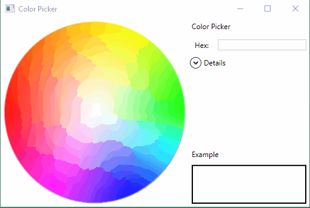

# Color Picker

The **Color Picker** application is a graphical program that allows a user select a color visually and read it's numeric values.

## Running

Open the ColorPicker.sln file with Visual Studio (2015 or newer) and click Start.

### Demo

